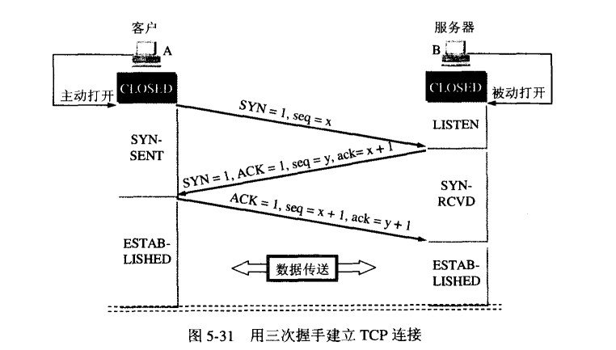
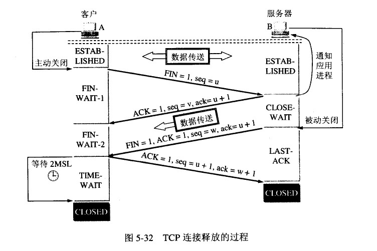

# HTTP-MDN

## HTTP 概述
超文本传输协议（Hypertext Transfer Protocol）,是`应用层`协议。

### UDP(User Data Protocol)
**面向报文**
UDP 是一个面向报文（报文可以理解为一段段的数据）的协议。意思就是 UDP 只是报文的搬运工，不会对报文进行任何拆分和拼接操作。

具体来说：

在发送端，应用层将数据传递给传输层的 UDP 协议，UDP 只会给数据增加一个 UDP 头标识下是 UDP 协议，然后就传递给网络层了
在接收端，网络层将数据传递给传输层，UDP 只去除 IP 报文头就传递给应用层，不会任何拼接操作

**不可靠性**

1. UDP 是无连接的，也就是说通信不需要建立和断开连接。
2. UDP 也是不可靠的。协议收到什么数据就传递什么数据，并且也不会备份数据，对方能不能收到是不关心的
3. UDP 没有拥塞控制，一直会以恒定的速度发送数据。即使网络条件不好，也不会对发送速率进行调整。这样实现的弊端就是在网络条件不好的情况下可能会导致丢包，但是优点也很明显，在某些实时性要求高的场景（比4如电话会议）就需要使用 UDP 而不是 TCP

**高效性**
因为 UDP 没有 TCP 那么复杂，需要保证数据不丢失且有序到达。所以 UDP 的头部开销小，只有八字节，相比 TCP 的至少二十字节要少得多，在传输数据报文时是很高效的。

**传输方式**
UDP 不止支持一对一的传输方式，同样支持一对多，多对多，多对一的方式，也就是说 UDP 提供了单播，多播，广播的功能

### TCP
TCP的头部比UDP复杂很多，对于 TCP(Transmission Control Protocol) 头部来说，以下几个字段是很重要的

|头部|详情|
|---|---|
|Sequence number|这个序号保证了 TCP 传输的报文都是有序的，对端可以通过序号顺序的拼接报文|
|Acknowledgement Number| 这个序号表示数据接收端期望接收的下一个字节的编号是多少，同时也表示上一个序号的数据已经收到|
|Window Size| 窗口大小，表示还能接收多少字节的数据，用于流量控制标识符|
|URG=1 |该字段为一表示本数据报的数据部分包含紧急信息，是一个高优先级数据报文，此时紧急指针有效。紧急数据一定位于当前数据包数据部分的最前面，紧急指针标明了紧急数据的尾部。|
|ACK=1 |该字段为一表示确认号字段有效。此外，TCP 还规定在连接建立后传送的所有报文段都必须把 ACK 置为一。|
|PSH=1 |该字段为一表示接收端应该立即将数据 push 给应用层，而不是等到缓冲区满后再提交。|
|RST=1 |该字段为一表示当前 TCP 连接出现严重问题，可能需要重新建立 TCP 连接，也可以用于拒绝非法的报文段和拒绝连接请求。|
|SYN=1 |当SYN=1，ACK=0时，表示当前报文段是一个连接请求报文。当SYN=1，ACK=1时，表示当前报文段是一个同意建立连接的应答报文。|
|FIN=1 |该字段为一表示此报文段是一个释放连接的请求报文。|

### TCP/IP协议族各层的作用
* 应用层：决定了向用户提供应用服务时通信的活动（发送HTTP报文）。FTP/DNS/HTTP
* 传输层：传输层对上层应用，网络连接中的计算机之间的数据传输。有TCP（transmission Control Protocol，传输控制协议）和 UDP(User Data Protocol，用户数据报协议) 
* 网络层（网络互联层）：网络层用来处理在网络上流动的数据包。IP
* 链路层（数据链路层，网络接口层）：用来处理连接网络的硬件部分。操作系统、设备驱动、NIC(网络设配器，网卡)，光纤

### HTTP的基本性质
* http是简单的。HTTP报文能够被人读懂，还允许简单测试，降低了门槛，对新人很友好。
* http是可扩展的。在HTTP/1.0出现的`HTTP Headers`让协议扩展变的很容易。
* HTTP是无状态的，有会话的。在同一个连接中，两次成功的请求之间是没有关联的，这导致用户无法进行连续的交互（如购物车问题）。
使用HTTP的头部扩展`HTTP Cookies`就可以解决这个问题。注意，HTTP本质是无状态的，使用Cookies可以创建有状态的会话。

### HTTP和连接
连接（一般指TCP连接）是由传输层控制的

HTTP/1.0

HTTP/1.0为每一个响应/请求都打开一个TCP连接，缺点： 打开一个TCP连接需要多次往返消息传递（三次握手），速度慢。

HTTP/1.1

HTTP/1.1引入了持久连接的概念，低层的TCP连接可以通过Connection（keep-alive）头部来被部分控制

为了更好的适合HTTP，设计一种更好传输协议的进程一直在进行。

Google就研发了一种以UDP为基础，能提供更可靠更高效的传输协议QUIC。

HTTP长连接和短连接这个说法是有有问题的。应该是TCP（传输层协议）连接。
1. http是应用层协议。应该是http请求/http响应
2. http1.0默认的是短连接，http1.1后默认的是长连接

**设置**
设置Connection为keep-alive，即为长连接

**TCP长连接**
tcp建立一次连接后不关闭（具体的时间长短，是可以在header当中进行设置的，也就是所谓的超时时间）。web中的js,css，html都是可以缓存的

**TCP短连接**
tcp每次建立连接后，请求完成，连接关闭。下次传输连接需要再次建立。

**优点与缺点**
1. 长连接可以减少tcp建立和关闭的操作，节约时间和带宽。
2. 短连接对于服务器来说管理较为简单，存在的连接都是有用的连接，不需要额外的控制手段

### HTTP能控制什么
* 缓存
* 开放同源策略
* 认证
* 代理和隧道
* 会话

### HTTP报文
**请求报文**
```javascript
GET/test/xx.txt  HTTP/ 1.1  // 起始行
Accept: text/* // 首部
Host: d.w.org // 首部
```

**响应报文**
```javascript
    HTTP/1.1 200 OK // 起始行
    Content-type: text/plain // 首部
    Content-length: 15 // 首部
    hi ni hao // 主体
```

## HTTP首部
|通用字段|	作用|
|-------|------|
|Cache-Control|	控制缓存的行为|
|Connection|浏览器想要优先使用的连接类型，比如 keep-alive|
|Date|创建报文时间|
|Pragma	|报文指令|
|Via|	|代理服务器相关信息|
|Transfer-Encoding|	传输编码方式|
|Upgrade|	要求客户端升级协议|
|Warning|	在内容中可能存在错误|


|请求字段|	作用|
|------|------|
|Accept	|能正确接收的媒体类型|
|Accept-Charset|	能正确接收的字符集|
|Accept-Encoding|	能正确接收的编码格式列表|
|Accept-Language|	能正确接收的语言列表|
|Expect|	期待服务端的指定行为|
|From|	请求方邮箱地址|
|Host|	服务器的域名|
|If-Match|	两端资源标记比较|
|If-Modified-Since|	本地资源未修改返回 304（比较时间）|
|If-None-Match|	本地资源未修改返回 304（比较标记）|
|User-Agent|	客户端信息|
|Max-Forwards|	限制可被代理及网关转发的次数|
|Proxy-Authorization|	向代理服务器发送验证信息|
|Range|	请求某个内容的一部分|
|Referer|	表示浏览器所访问的前一个页面|
|TE|	传输编码方式|


|响应字段|	作用|
|-----|-----|
|Accept-Ranges|	是否支持某些种类的范围|
|Age|	资源在代理缓存中存在的时间|
|ETag|	资源标识|
|Location|	客户端重定向到某个 URL|
|Proxy-Authenticate|	向代理服务器发送验证信息|
|Server|	服务器名字|
|WWW-Authenticate|	获取资源需要的验证信息|
|实体字段|	作用|
|Allow|	资源的正确请求方式|
|Content-Encoding|	内容的编码格式|
|Content-Language|	内容使用的语言|
|Content-Length|	request body 长度|
|Content-Location|	返回数据的备用地址|
|Content-MD5|	Base64加密格式的内容 MD5检验值|
|Content-Range|	内容的位置范围|
|Content-Type|	内容的媒体类型|
|Expires|	内容的过期时间|
|Last_modified|	内容的最后修改时间|

## HTTP状态码
**类别**
|状态码|类别|原因|
|---|---|---|
|1XX|Informational(信息性状态码)|接收的请求正在处理|
|2XX|Success|请求正常处理完毕|
|3XX|Redirectin|需要进行附加操以完成请求|
|4XX|Client Error(客户端错误)|服务器无法处理请求|
|5XX|Server Error|服务器请求出错|

**状态码详情**
* 100
> 表示目前为止一切正常, 客户端应该继续请求, 如果已完成请求则忽略

* 200 表明请求已经成功. 默认情况下成功的请求将会被缓存。不同请求方式对于请求成功的意义如下:
    *  GET: 已经取得资源，并将资源添加到响应中的消息体.
    * HEAD: 作为消息体的头部信息.
    * POST: 消息体中描述此次请求的结果.
    * TRACE: 响应的消息体包含服务器接收到的请求信息.
* 201 是一个代表成功的应答状态码，表示请求已经被成功处理，并且创建了新的资源。新的资源在应答返回之前已经被创建。同时新增的资源会在应答消息体中返回，其地址或者是原始请求的路径，或者是 Location 首部的值。


* 300 是一个用来表示重定向的响应状态码，表示该请求拥有多种可能的响应。用户代理或者用户自身应该从中选择一个。
* 301 永久重定向 说明请求的资源已经被移动到了由 Location 头部指定的url上，是固定的不会再改变。搜索引擎会根据该响应修正。

* 302 重定向状态码表明请求的资源被暂时的移动到了由Location 头部指定的 URL 上。浏览器会重定向到这个URL， 但是搜索引擎不会对该资源的链接进行更新
* 303 重定向状态码，通常作为 PUT 或 POST 操作的返回结果，它表示重定向链接指向的不是新上传的资源，而是另外一个页面，比如消息确认页面或上传进度页面。而请求重定向页面的方法要总是使用 GET。

* 304 浏览器已缓存，不用再请求服务器资源
* 307 临时重定向）是表示重定向的响应状态码，说明请求的资源暂时地被移动到  Location 首部所指向的 URL 上。
> 状态码 307 与 302 之间的唯一区别在于，当发送重定向请求的时候，307 状态码可以确保请求方法和消息主体不会发生变化。当响应状态码为 302 的时候，一些旧有的用户代理会错误地将请求方法转换为 GET：使用非 GET 请求方法而返回 302 状态码，Web 应用的运行状况是不可预测的；而返回 307 状态码时则是可预测的。对于 GET 请求来说，两种情况没有区别。

* 308 永久重定向）是表示重定向的响应状态码，说明请求的资源已经被永久的移动到了由 Location 首部指定的 URL 上。
> 在重定向过程中，请求方法和消息主体不会发生改变，然而在返回 301 状态码的情况下，请求方法有时候会被客户端错误地修改为 GET 方法。

* 401 代表客户端错误，指的是由于缺乏目标资源要求的身份验证凭证，发送的请求未得到满足。
* 403 代表客户端错误，指的是服务器端有能力处理该请求，但是拒绝授权访问。
* 404 代表客户端错误，指的是服务器端无法找到所请求的资源。由于它的频繁出现，这个状态码估计是最著名的一个了。返回该响应的链接通常称为坏链（broken link）或死链（dead link），它们会导向链接出错处理(link rot)页面。
* 405 表明服务器禁止了使用当前 HTTP 方法的请求。需要注意的是，GET 与 HEAD 两个方法不得被禁止，当然也不得返回状态码 405。
* 500 是表示服务器端错误的响应状态码，意味着所请求的服务器遇到意外的情况并阻止其执行请求。
* 503 是一种HTTP协议的服务器端错误状态代码，它表示服务器尚未处于可以接受请求的状态。常造成这种情况的原因是由于服务器停机维护或者已超载。

# Https
HTTPS 还是通过了 HTTP 来传输信息，但是信息通过 TLS （传输层安全协议，Transport Layer Security）协议进行了加密。
**TLS**
TLS协议位于传输层之上，应用层之下。首次进行TLS协议传输时需要两个RTT(同一个封包来回时间（Round-Trip Time）)。接下来可以通过Session Resumption（会话复用） 减少到一个 RTT。


**在 TLS 中使用了两种加密技术，分别为：对称加密和非对称加密**

* 对称加密。对称加密就是两边拥有相同的秘钥，两边都知道如何将密文加密解密。

* 非对称加密。有公钥私钥之分，公钥所有人都可以知道，可以将数据用公钥加密，但是将数据解密必须使用私钥解密，私钥只有分发公钥的一方才知道。

TLS 握手过程如下图
**TCP连接建立（3次握手）**

在 TLS 握手阶段，两端使用非对称加密的方式来通信，但是因为非对称加密损耗的性能比对称加密大，所以在正式传输数据时，两端使用对称加密的方式通信。

* B服务端先创建TCB（传输控制模块: 存储了连接中的重要信息，如：tcp连接表，接收和发送的信号），准备接受客户端的请求，然后进程属于LISTEN状态，等待客户的连接。
* A客户端先创建TCB，然后向B发送请求报文。1
* B服务端接受到请求报文，如同意建立连接则确认。2
* A客户端接收到B的确认后，还要再次向B服务端发送确认。3



**TCP连接释放（4次挥手）**
A、B端都处于连接已建立的状态。

* A客户端先向TCP发出连接释放报文段，并停止发送数据，主动关闭TCP连接。1
* B服务端接收到释放信号，发出确认。然后进入关闭等待状态。2
* A客户端接收到B的确认信号后，进入终止等待。等待B发出的连接释放报文段。3
* B发出连接释放报文段,A需要再次确认。4



# HTTP2.0
HTTP 2.0 相比于 HTTP 1.X，可以说是大幅度提高了 web 的性能。

在 HTTP 1.X 中，为了性能考虑，我们会引入雪碧图、将小图内联、使用多个域名等等的方式。这一切都是因为浏览器限制了同一个域名下的请求数量，当页面中需要请求很多资源的时候，队头阻塞（Head of line blocking）会导致在达到最大请求数量时，剩余的资源需要等待其他资源请求完成后才能发起请求。

### 二进制传输
HTTP 2.0 中所有加强性能的核心点在于此。在之前的 HTTP 版本中，我们是通过**文本**的方式传输数据。在 HTTP 2.0 中引入了新的编码机制，所有传输的数据都会被分割，并采用**二进制**格式编码。

### 多路复用
在HTTP2.0中有两个非常重要的概念：帧（frame）和流(stream),帧代表着最小的数据单位，流由帧组成。
**多路复用**
就是在一个 TCP 连接中可以存在多条流。换句话说，也就是可以发送多个请求，对端可以通过帧中的标识知道属于哪个请求。通过这个技术，可以避免 HTTP 旧版本中的队头阻塞问题，极大的提高传输性能。

### Header压缩
在 HTTP 1.X 中，我们使用文本的形式传输 header，在 header 携带 cookie 的情况下，可能每次都需要重复传输几百到几千的字节。

在 HTTP 2.0 中，使用了 HPACK 压缩格式对传输的 header 进行编码，减少了 header 的大小。并在两端维护了索引表，用于记录出现过的 header ，后面在传输过程中就可以传输已经记录过的 header 的键名，对端收到数据后就可以通过键名找到对应的值

### 服务端Push
在 HTTP 2.0 中，服务端可以在客户端某个请求后，主动推送其他资源。

可以想象以下情况，某些资源客户端是一定会请求的，这时就可以采取服务端 push 的技术，提前给客户端推送必要的资源，这样就可以相对减少一点延迟时间。当然在浏览器兼容的情况下你也可以使用 prefetch

### QUIC（快速UDP网络连接）
这是一个谷歌出品的基于 UDP 实现的同为传输层的协议，目标很远大，希望替代 TCP 协议。

* 该协议支持多路复用，虽然 HTTP 2.0 也支持多路复用，但是下层仍是 TCP，因为 TCP 的重传机制，只要一个包丢失就得判断丢失包并且重传，导致发生队头阻塞的问题，但是 UDP 没有这个机制
* 实现了自己的加密协议，通过类似 TCP 的 TFO 机制可以实现 0-RTT，当然 TLS 1.3 已经实现了 0-RTT 了
* 支持重传和纠错机制（向前恢复），在只丢失一个包的情况下不需要重传，使用纠错机制恢复丢失的包
    * 纠错机制：通过异或的方式，算出发出去的数据的异或值并单独发出一个包，服务端在发现有一个包丢失的情况下，通过其他数据包和异或值包算出丢失包
    * 在丢失两个包或以上的情况就使用重传机制，因为算不出来

# 计算机通识
## DNS
DNS 的作用就是通过域名查询到具体的 IP。

因为 IP 存在数字和英文的组合（IPv6），很不利于人类记忆，所以就出现了域名。你可以把域名看成是某个 IP 的别名，DNS 就是去查询这个别名的真正名称是什么。

在 TCP 握手之前就已经进行了 DNS 查询，这个查询是操作系统自己做的。当你在浏览器中想访问 www.google.com 时，会进行一下操作：

1. 操作系统会首先在本地缓存中查询
2. 没有的话会去系统配置的 DNS 服务器中查询
3. 如果这时候还没得话，会直接去 DNS 根服务器查询，这一步查询会找出负责 com 这个一级域名的服务器
4. 然后去该服务器查询 google 这个二级域名
5. 接下来三级域名的查询其实是我们配置的，你可以给 www 这个域名配置一个 IP，然后还可以给别的三级域名配置一个 IP

以上介绍的是 DNS 迭代查询，还有种是递归查询，区别就是前者是由客户端去做请求，后者是由系统配置的 DNS 服务器做请求，得到结果后将数据返回给客户端。

PS：DNS 是基于 UDP 做的查询。

## 从输入URL到页面加载完成发生了什么
这是一个很经典的面试题，在这题中可以将本文讲得内容都串联起来。

### 一
1. 首先做 DNS 查询，如果这一步做了智能 DNS 解析的话，会提供访问速度最快的 IP 地址回来
2. 接下来是 TCP 握手，应用层会下发数据给传输层，这里 TCP 协议会指明两端的端口号，然后下发给网络层。网络层中的 IP 协议会确定 IP 地址，并且指示了数据传输中如何跳转路由器。然后包会再被封装到数据链路层的数据帧结构中，最后就是物理层面的传输了
3. TCP 握手结束后会进行 TLS 握手，然后就开始正式的传输数据
4. 数据在进入服务端之前，可能还会先经过负责负载均衡的服务器，它的作用就是将请求合理的分发到多台服务器上，这时假设服务端会响应一个 HTML 文件
5. 首先浏览器会判断状态码是什么，如果是 200 那就继续解析，如果 400 或 500 的话就会报错，如果 300 的话会进行重定向，这里会有个重定向计数器，避免过多次的重定向，超过次数也会报错
6. 浏览器开始解析文件，如果是 gzip 格式的话会先解压一下，然后通过文件的编码格式知道该如何去解码文件
7. 文件解码成功后会正式开始渲染流程，先会根据 HTML 构建 DOM 树，有 CSS 的话会去构建 CSSOM 树。如果遇到 script 标签的话，会判断是否存在 async 或者 defer ，前者会并行进行下载并执行 JS，后者会先下载文件，然后等待 HTML 解析完成后顺序执行，如果以上都没有，就会阻塞住渲染流程直到 JS 执行完毕。遇到文件下载的会去下载文件，这里如果使用 HTTP 2.0 协议的话会极大的提高多图的下载效率。
8. 初始的 HTML 被完全加载和解析后会触发 DOMContentLoaded 事件
9. CSSOM 树和 DOM 树构建完成后会开始生成 Render 树，这一步就是确定页面元素的布局、样式等等诸多方面的东西
10. 在生成 Render 树的过程中，浏览器就开始调用 GPU 绘制，合成图层，将内容显示在屏幕上了


### 二
1. 域名解析，查找缓存
    * 查找浏览器缓存（DNS缓存）
    * 查找操作系统缓存（如果浏览器缓存没有，浏览器会从hosts文件查找是否有DNS信息）
    * 查找路由器缓存
    * 查找ISP缓存
2. 浏览器获得对应的ip地址后，浏览器与远程Web服务器通过TCP三次握手协商来建立一个TCP/IP连接。 
3. TCP/IP连接建立起来后，浏览器就可以向服务器发送HTTP请求 
4. 服务器处理请求，返回资源（MVC设计模式） 
5. 浏览器处理（加载，解析，渲染）
    * HTML页面加载顺序从上而下
    * 解析文档为有意义的结构，DOM树；解析css文件为样式表对象
    * 渲染。将DOM树进行可视化表示
6. 绘制网页
    * 浏览器根据HTML和CSS计算得到渲染数，最终绘制到屏幕上
    * 一个完整HTTP请求的过程为： DNS Resolving -> TCP handshake -> HTTP Request -> Server -> HTTP Response -> TCP shutdow

## 浏览器的缓存机制
### ETag(验证令牌) 验证缓存的响应
* 服务器使用 ETag HTTP 标头传递验证令牌。
* 验证令牌可实现高效的资源更新检查：资源未发生变化时不会传送任何数据

### cache-control
* 每个资源都可通过 Cache-Control HTTP 标头定义其缓存策略
* Cache-Control 指令控制谁在什么条件下可以缓存响应以及可以缓存多久

### 缓存层次结构和技巧
* 使用一致的网址：如果您在不同的网址上提供相同的内容，将会多次提取和存储这些内容。 提示：请注意，网址区分大小写。
* 确保服务器提供验证令牌 (ETag)：有了验证令牌，当服务器上的资源未发生变化时，就不需要传送相同的字节。
* 确定中间缓存可以缓存哪些资源：对所有用户的响应完全相同的资源非常适合由 CDN 以及其他中间缓存进行缓存。
* 为每个资源确定最佳缓存周期：不同的资源可能有不同的更新要求。 为每个资源审核并确定合适的 max-age。
* 确定最适合您的网站的缓存层次结构：您可以通过为 HTML 文档组合使用包含内容指纹（版本号）的资源网址和短时间或 no-cache 周期，来控制客户端获取更新的速度。
* 最大限度减少搅动：某些资源的更新比其他资源频繁。 如果资源的特定部分（例如 JavaScript 函数或 CSS 样式集）会经常更新，可以考虑将其代码作为单独的文件提供。 这样一来，每次提取更新时，其余内容（例如变化不是很频繁的内容库代码）可以从缓存提取，从而最大限度减少下载的内容大小。