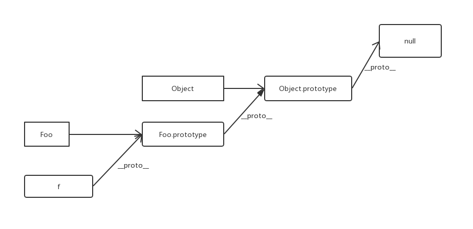

题目->考点->知识再到题目

# window.onload与DOMContentLoaded

1. 当 `onload` 事件触发时，页面上所有的DOM，样式表，脚本，图片，flash都已经加载完成了。
2. 当 `DOMContentLoaded` 事件触发时，仅当DOM加载完成，不包括样式表，图片，flash 

# 变量类型和计算

**类型**

- 值类型。栈内存(栈是为执行线程留出的内存空间,栈附属于线程，因此当线程结束时栈被回收)

- 引用类型(对象、数组、函数)。堆内存（堆（heap）是为动态分配预留的内存空间,堆通常通过运行时在应用程序启动时被分配，当应用程序（进程）退出时被回收）。

- typeof。只能识别值类型和函数，不能识别引用类型

  ```javascript
  typeof undefined // undefined
  typeof 123 // number
  typeof 'rty' // string
  typeof true // boolean
  typeof null // object
  typeof {} // object
  typeof [] // object
  typeof console.log // function
  ```

**计算-强制类型转换**

- 字符串拼接。
- ==。
- if。
- 逻辑运算符。（tips：!!undefined）
- 何时使用==和===？除了（obj.a == null ,jquery源码写法）其它均用===

# 内置对象
10个函数类型( String,Number,Boolean,Array,Function,Date,RegExp,Error,Object,Event )函数类型 有 `__proto__`和 `prototype` 属性。

2个对象类型（Math,JSON） 对象类型只有`__proto__`属性。

- Object
- Array
- Boolean
- Numner
- String
- Function
- Date
- RegExp
- Error
- ~~Math内置对象~~

# 原型和原型链

**构造函数**

- 名称首字母大写。
- 默认`return this`

```javascript
function Food(){
    this.cai = cai;
    // return this // 默认返回
}
```

**构造函数-扩展**

```javascript
var a = {} 其实是var a = new Object()的语法糖
var a = [] 其实是var a = new Object()的语法糖
function Foo() {} 其实是var Foo = new Function()
```

**基本概念**

* 原型：所有的函数才有的`prototype`属性，`prototype`属性值是一个普通的对象。
* 原型链：JavaScript 常被描述为一种**基于原型的语言 (prototype-based language)**——每个对象拥有一个**原型对象**，对象以其原型为模板、从原型继承方法和属性。原型对象也可能拥有原型，并从中继承方法和属性，一层一层、以此类推。这种关系常被称为**原型链 (prototype chain)**，它解释了为何一个对象会拥有定义在其他对象中的属性和方法。
* 对象实例和它的构造器之间建立一个链接（它是`__proto__`属性，是从构造函数的`prototype`属性派生的），之后通过上溯原型链，在构造器中找到这些属性和方法。

* JavaScript是动态的没有class实现。在ES6中引入了`class`关键字，但是是语法糖。
* 谈到继承时，JavaScript只有一种结构：对象。每个object都有一个私有属性（`__proto__`)指向它的原型对象（prototype）。该原型对象也有一个自己的（`__proto__`），层层往上直到一个对象的原型对象为`null`。根据定义，`null`没有原型。

## 原型规则（5条规则）和实例

1. 所有的引用类型（数组、对象、函数），都具有对象特性，即可自由拓展属性（除了null）。
2. 所有的引用类型（数组、对象、函数），都具有一个`__proto__`（隐式原型）属性，属性值是一个普通的对象。
3. 所有的函数，都有一个`prototype`（原型）属性，属性值也是一个普通的对象。里边有一个`constructor`，指向函数自身。
4. 所有的的引用类型（数组、函数、对象），`__proto__`（隐式原型）属性值指向它构造函数的`prototype`（原型）属性值。`obj.__proto__ === Object.prototype // true`
5. 当试图得到一个对象的某个属性时，如果这个对象本身没有这个属性，那么会去它的`__proto__`(即构造函数的prototype)中寻找。

**循环对象自身的属性**

```javascript
for (var i in obj) {
    if (obj.hasOwnProperty(i)) {
        // 高级浏览器已经在for in中屏蔽了来自原型链的属性
    }
}
```

## 原型链

**例子**

```javascript
// 构造函数
function Foo(name, age) {
    this.name = name;
    this.age = age;
}

Foo.prototype.alertName = function () {
    alert(this.name)
}
// 创建示例
var f = new Foo('kk', 90);
f.printName = function () {
	console.log(this.name)
}
// 测试
f.printName()
f.alertName()
f.toString() // 要去 f.__proto.__proto__找
```

**图示**



**使用instanceof判断一个函数是否是一个变量的构造函数**

- f instanceof Foo的判断逻辑：

1. f 的`__proto__`一层层往上，能否对应到Foo.prototype
2. 再试着判断f instanceof Object

`__proto__`不是标准属性，并且该属性不是标准属性，不可以用在编程中，用于浏览器内部
## 例题

**如何准确判断一个变量是数组**

```javascript
// arr instanceof Array

// 判断数组
function isArray(arr) {
    if (typeof Array.isArray === 'function') {
        return Array.isArray(arr);
    } else {
        return Object.prototype.toString.call(arr) === '[object Array]';
    }
}
```


**写一个原型链继承的例子**

```javascript
// 形象例子
function Animal() {
    this.eat = function() {console.log('animal eat');}
}

function Cat(){
    this.mill = function() {console.log('cat mill');}
}
// 原型链继承
Cat.prototype = new Animal();

var bosimao = new Cat();
```

```javascript
// 接近实战的例子
function Ele(id) {
    this.elem = document.getElementById(id)
}

Ele.prototype.html = function(val) {
    var elem = this.elem
    if (val) {
        elem.innerHTML = val
        return this //链式调用
        } else {
        return elem.innerHTML
    }
}

Ele.ptototype.on = function(type, handle) {
    var elem = this.elem
    elem.addEventListner(type, handle)
    return this // 链式调用
}

var divc = new Ele('id');
divc.on('click', function(e){
    console.log('i am click')
})
```


**描述new一个对象的例子**
1、创建一个空对象，并且this变量引用该对象，同时继承了该函数的原型（实例对象通过__proto__属性指向原型对象；obj.__proto__ = Base.prototype;） 2、属性和方法被加入到 this 引用的对象中。

```javascript
1. 创建一个新对象
2. this指向这个新对象
3. 执行代码对this赋值
4. 返回this
function Food(){
    this.cai = cai;
    // return this // 默认有这一行
}
```

详解
```javascript
function myNew(_constructor, arg) {
  var obj = {};
  obj._proto_ = _constructor.prototype;
  //把该对象的原型指向构造函数的原型对象，就建立起原型了：obj->Animal.prototype->Object.prototype->null
  return _constructor.call(obj, arg);
}
```

**zepto（或其它框架）源码中如何使用原型链**

```javascript

```

# 作用域和闭包

### 基础知识

* 执行上下文。

* this。要在执行时才能确认，定义时无法确认。

* call,bind,apply

  ```javascript
  // 指定为null和undefined的this值会自动指向全局对象(浏览器中就是window对象)
  fun.call(thisArg, arg1, arg2, ...)
  fun.apply(thisArg, [argsArray])
  // 创建一个新函数，在调用时设置this关键字为提供的值。
  function.bind(thisArg[, arg1[, arg2[, ...]]])
  ```

## 作用域

* 没有块级作用域
* 只有函数和全局作用域
* 作用域链。由函数和全局作用域组成
* 自由变量，到父作用域（定义的时候决定）寻找

## 闭包

不要尝试用几句话去说明闭包

**使用场景**

* 函数作为返回值
* 函数作为参数传递

## 例题

**对变量提升的理解**

* 变量定义
* 函数声明（注意函数表达式的区别）
* 作用域链

**说明this的几种不同使用场景**

* 作为构造函数执行
* 作为对象属性执行
* 作为普通函数执行
* call apply bind

**创建10个a标签，点击弹出相应的序号**

```javascript
  var i;
  for (i = 0; i < 10; i++) {
    (function (i) {
      var a = document.createElement('a');
      a.innerHTML = i + '<br>';
      a.addEventListener('', function (e) {
        e.preventDefault();
        alert(i); // 自由变量，要去父作用域获取值
      });
      document.body.appendChild(a);
    })(i)
  }
```

**如何理解作用域**

* 自由变量
* 作用域链，即自由变量的查找
* 闭包的两个应用场景

**实际开发中闭包的应用**
实际开发中主要用于封装变量，收敛权限

# 异步和单线程

## 异步
**异步与同步区别**
* 是否会阻塞代码执行
* alert是同步，setTimeout是异步

## 前端使用异步的场景
* 定时任务：setTimeout、setInterval
* 网络请求：ajax请求，动态img加载
* 事件绑定

## 异步和单线程
**单线程**
* 一次只能执行一个任务
* 不能同时干两件事情

## Date Math Array Object
**Date**
```javascript
Date.now() // 获取当前时间的毫秒数
var dt = new Date()
dt.getTime() // 获取毫秒数
dt.getFullYear() // 年
dt.getMonth()
dt.getDay()
dt.getHours()
dt.getMinutes()
dt.getSeconds()
```
**Math**
```javascript
Math.random() // 获取随机数
```
**Array**
```javascript
forEach()
every()
some()
sort()
map()
filter()
```
**Object**
```
for in
```
**写一个能遍历对象和数组的函数**
```javascript
function forEach(obj, callback) {
  var key;
  if (obj instanceof Array) {
    obj.forEach(function (item, index) {
      callback(index, item);
    })
  } else {
    for (key in obj) {
      callback(key, obj[key]);
    }
  }
}
```
# Web API
## DOM本质
HTML（HyperText Markup Language）
结构：dom树
## DOM节点操作
**获取DOM节点**
```javascript
  getElementById() //元素
  getElementsByTagName() //集合
  getElementsByClassName() // 集合
  querySelectorAll()
  querySelector() 
```
**proterty**
js属性
```javascript
  style,className,nodeName,nodeType
```
**Attribute**
```javascript
  html属性
```

## DOM结构操作
```javascript
  createElement(),appendChild(),.parentElement,childNodes,removeChild()
```
## 题目
* DOM是哪种基本的数据结构
* DOM常用的操作API
* DOM节点的attr和property有何区别

## 事件绑定
```javascript
  function bindEvent(elem, type, selector, fn) {
    if(fn == null) {
      fn = selector;
      selector = null;
    }
    elem.addEventListener(type, function(e) {
      var target；
      if(selector) {
        // 代理
        target = e.target；
        if(target.matches(selector)) {
          fn.call(target, e)
        }
      } else {
        fn(e)
      }
    })
  }
```

## 事件冒泡
* DOM树形结构
* 事件冒泡
* 阻止冒泡
* 冒泡的应用

代理：
  1. 代码简洁
  2. 浏览器压力小

## XHR
**XMLHttpRequest**
```
var xhr = new XMLHttpRequest()
xhr.open('GET', 'url', false)
xhr.onreadystatechange = function () {
  if(xhr.readyState === 4) {
    if(xhr.status === 2) {
      xhr.response
    }
  }
}
xhr.send(null)
```
|readyState|作用|
|---|---|
|0|未初始化，还未调用send()|
|1|已调用send(),还在发送请求|
|2|请求发送成功，已经接收到响应内容|
|3|解析响应内容|
|4|相应内容解析完成，可以在客户端用了|

**跨域**
* 浏览器有同源策略，不允许ajax访问其他域的接口
* 跨域条件：协议，域名，端口

**可以跨域的标签**
* img：用于打点统计，统计网站可能是其他域
* link，script：可以使用cdn，cdn也能是其域
* script可以用于jsonp

1. JSONP实现原理。
2. 服务端设置http header

**存储** 
**cookie**
* 本身是用于客户端与服务端通信。
* 但是它本有本地存储的功能，于是就被借用

缺点：
1. 存储量太小，只有4kb
2. 所有的http请求都带着，会影响获取资源的效率
3. api简单，document.cookie,需要封装

**localStorage，sessionStorage**
* HTML5为存储而设计的。最大容量5M
* api简单易用

### cookie，sessionStorage，localStorage区别
* 容量
* api易用性
* ajax是否携带

# 关于开发环境
## git
**代码管理**
* 将当前服务器的代码全部打包并记录版本号，备份
* 将测试完成的代码提交到git版本库的master分支
**上线回滚**
* 将当前服务器的代码打包并记录版本号，备份
* 将备份的上一个版本号解压，覆盖到线上服务器，并生成新的版本号

基本命令：
```

```
## 模块化
**AMD**
* 对于依赖的模块,amd是提前执行（提前读取并加载），
* cmd是延迟执行，按需加载（提前读取不加载）。CMD 推崇 as lazy as possible
**webpack**
```javascript
  var path = require('path')
  var webpack = require('path')
  module.exports = {
    context: path.resolve(__dirname, './src'),
    entry: {
      app: './app.js'
    },
    output: {
      path: path.resolve(__dirname, './dist')
      filename: 'bundle.js'
    }
  }
```

# 运行环境
## 页面加载过程
## 性能优化
* 多使用内存，缓存或者其它方法
* 减少CPU计算，减少网络

从哪里入手：
**加载资源优化**
1. 静态资源的压缩合并

2. 静态资源的缓存

3. 使用cdn让资源加载更快
  * cdn原理：CDN做了两件事，一是让用户访问最近的节点，二是从缓存或者源站获取资源CDN的工作原理：通过dns服务器来实现优质节点的选择，通过缓存来减少源站的压力
4. 使用SRR后端渲染，数据直接输出到HTMl

**渲染优化**
* css放前面，JS放后面
* 懒加载（图片懒加载）
* 减少DOM查询，对DOM查询做缓存
* 减少DOM操作，多个操作尽量合并在一起执行
## 安全性
**XSS跨站请求攻击**
插入一段script
**XSRF跨站请求伪造**

## 浅拷贝和深拷贝
1. 最大的区别就是基本类型和对象类型：基本类型是传值，对象类型是传引用
2. 浅拷贝只复制指向某个对象的指针，而不复制对象本身，新旧对象还是共享同一块内存。但深拷贝会另外创造一个一模一样的对象，新对象跟原对象不共享内存，修改新对象不会改到原对象。

### 深拷贝的实现
ES6,针对深拷贝，需要使用其他办法，因为 Object.assign()拷贝的是属性值。假如源对象的属性值是一个对象的引用，那么它也只指向那个引用
```javascript
  var obj = { a: 0 , b: { c: 0}}; 
  // ES6
  Object.assign({}, obj)
```

JSON
```javascript
  var obj = { a: 0 , b: { c: 0}}; 
  JSON.parse(JSON.stringify(obj))
```

递归
```
(function ($) {
    'use strict';

    var types = 'Array Object String Date RegExp Function Boolean Number Null Undefined'.split(' ');

	function type () {
	   return Object.prototype.toString.call(this).slice(8, -1);
	}

	for (var i = types.length; i--;) {
	    $['is' + types[i]] = (function (self) {
	        return function (elem) {
	           return type.call(elem) === self;
	        };
	    })(types[i]);
	}

    return $;
})(window.$ || (window.$ = {}));//类型判断

function copy (obj,deep) { 
    if ($.isFunction(obj)) {
    	return new Function("return " + obj.toString())();
    } else if (obj === null || (typeof obj !== "object")) { 
        return obj; 
    } else {
        var name, target = $.isArray(obj) ? [] : {}, value; 

        for (name in obj) { 
            value = obj[name]; 

            if (value === obj) {
            	continue;
            }

            if (deep) {
                if ($.isArray(value) || $.isObject(value)) {
                    target[name] = copy(value,deep);
                } else if ($.isFunction(value)) {
                    target[name] = new Function("return " + value.toString())();
                } else {
            	    target[name] = value;
                } 
            } else {
            	target[name] = value;
            } 
        } 
        return target;
    }　        
}
```

## 跨域
跨域是发生在浏览器端

jsonp的原理和简单实现
1. 动态创建script(script的src实现跨域)标签
2. 通过将前端方法作为参数传递到服务器端，然后由服务器端注入参数之后再返回，实现服务器端向客户端通信。
3. 只能支持get方法

```javascript
  function jsonp (req) {
    var script = document.createElement('script')
    var url = req.url + '?callback=' + req.callback.name
    script.src = url
    document.getElementsByTagName('head')[0].appendChild(script)
  }
```

## for of,for in, Object.keys()
for..of和for...in的区别, 使用时注意用Object.hasOwnProperty判断是否真的包含元素
```
var a = [4,1,6]
for(var i of a) {console.log(i)} // 4,1,6
for(var i in a) {console.log(i)} // 0,1,2
```

Object.keys与for...of的区别：
1. Object.keys不会遍历到__proto__
